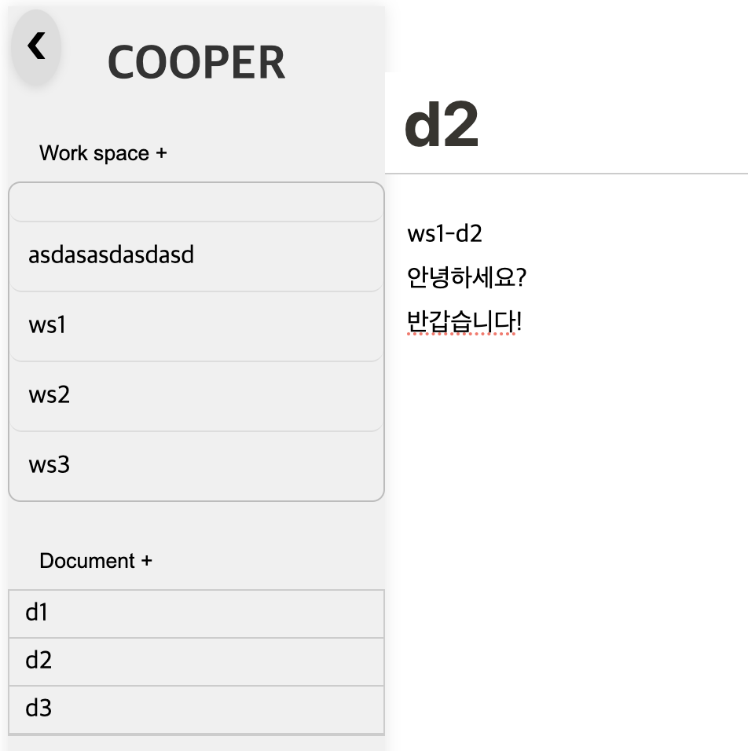

# cooper-real-time-document
➤ Real-time document like the 'Notion'

<br>
 
## 전체적인 구조
* 사용자들은 로그인을 하면 나오는 화면에서 웹소켓 연결(SockJS, Stomp)을 맺는다. 이를 통해 아래와 같은 일들이 이뤄진다.  
  * 워크스페이스의 생성 및 삭제가 실시간으로 동기화 된다.  
  * 문서의 생성 및 삭제가 실시간으로 동기화 된다.  
* 워크스패이스 내 문서를 클릭하면 각 문서별 엔드포인트에 대한 Stomp 구독을 하게 된다. 이를 통해 실시간 문서 작업을 할 수 있게 된다. 다른 문서를 클릭하면 기존 구독을 해제하고 새로운 구독을 설정한다.  
* 각 문서 내에는 여러 텍스트 블록이 존재한다. 문서 작업은 블록 단위로 이뤄지고, 블록들은 DB에서 고유 position값과 함께 저장된다.  

<br>

## 엔드포인트(Endpoint) - WebSocket  
* **"/ws/workspace"** : WebSocket Endpoint  
  * 사용자들은 이 Endpoint에 기본적으로 연결된다.  
  * 이 연결을 기반으로 특정 경로를 구독함으로써 실시간 동기화를 가능하게 한다.  

* **"/sub/workspace"** : 모두가 공통으로 구독하는 경로  
  * 이 경로를 구독함으로써 워크스페이스 및 문서의 생성, 삭제가 실시간으로 동기화 된다.  
  * 메시지를 보낼 때는 **"/pub/workspace"** 경로로 보낸다.  
  * Java Controller에서는 받은 메시지를 별도의 처리 없이 그대로 클라이언트로 전송한다.  
  * 주고 받는 JSON 형식은 아래와 같다.  
    * 워크스페이스 생성 및 삭제:  
     ```js 
     {
      type: "workspace",
      userId: this.userId, 
      workspaces: result.data, 
      workspaceId: newWorkspace.id
    }
     ```  
     * 문서 생성  
     ```js  
     {
      type: "document", 
      userId: this.userId, 
      documents: result.data, 
      workspaceId: this.selectedWorkspace.id
     }
     ```  
     * 문서 삭제  
     ```js  
     {
      type: "document", 
      userId: this.userId, 
      documents: result.data, 
      workspaceId: this.selectedWorkspace.id, 
      documentId: documentId
     }  
     ```

* **"/sub/workspace/\${wsId}/document/\${docId}"** : 문서별로 구독하는 경로  
  * 특정 워크스페이스 내 문서를 클릭하면 이 경로를 구독하게 된다.  
  * 이 경로를 구독함으로써 문서 내 텍스트 블록들이 실시간으로 동기화 된다.  
  * 메시지를 보낼 때는 **"/pub/workspace/\${wsId}/document/\${docId}"** 경로로 보낸다.  
  * Java Controller는 받은 메시지의 type을 확인하여 그에 맞는 처리를 한 뒤, 메시지를 응답 메시지로 전송한다.  
  * 응답 메시지를 받은 클라이언트 역시 type에 따른 처리를 수행한다.  
  * 주고 받는 JSON 형식은 아래와 같다.  
    * 블록 생성("new"), 기존 블록에 텍스트 입력("old"), 블록 삭제("del")  
    ```js
    {
      type: "new || old || del", 
      userId: this.userId, 
      block: {id: 블록 id, text: 블록 내 text}, 
      position: index+1
    }
    ```  

<br>

## 엔드포인트(Endpoint) - RestAPI  
* **"/cooper-docs/workspace"**  
  * **Get** 요청  
    * DB에 저장된 전체 워크스페이스 목록을 반환한다.  
    * 워크스페이스 목록은 워크스페이스 이름을 기준으로 오름차순 정렬되어 반환된다.  
    * 응답 메시지 형태는 다음과 같다.  
    ```json
    [
      {
      "id": "871c90c4-6b68-4b43-847d-752aaaa4f9bb",
      "name": "asdasasdasdasd"
      },
      {
      "id": "4be9baaa-8787-46ae-948f-5697af3d164b",
      "name": "ws1"
      },
      {
      "id": "94404d23-6291-4970-acaf-1e0c612225f6",
      "name": "ws2"
      },
      {
      "id": "9ce70e8f-63bc-4c45-87fd-d625030f2099",
      "name": "ws3"
      }
    ]
    ```  
* **"/cooper-docs/workspace/${워크스페이스 Id}"**  
  * **Post** 요청  
    * 새 워크스페이스를 생성하고 갱신된 워크스페이스 목록을 반환한다.  
    * Axios 요청을 보낼 때 FormData로 생성할 워크스페이스의 id와 name을 담아서 보낸다.  
    * 응답 메시지 형태는 **"/cooper-docs/workspace"** 경로로 Get 요청을 보냈을 때의 응답 메시지와 동일하다.  
  * **Delete** 요청  
    * 기존 워크스페이스를 삭제하고 갱신된 워크스페이스 목록을 반환한다.  
    * PathVariable로 전송된 워크스페이스의 Id를 기준으로 DB에서 삭제 쿼리가 이뤄진다.  
    * 응답 메시지 형태는 역시 전체 워크스페이스 목록으로, 위와 동일하다.  
* **"/cooper-docs/workspace/${workspaceId}/document"**  
  * **Get** 요청  
    * 특정 워크스페이스를 선택하면 이 경로로 Get 요청을 보낸다.  
    * 선택한 워크스페이스에 저장된 문서의 목록을 반환한다.  
    * 응답 메시지의 형태는 다음과 같다. id는 DB에서 자동으로 생성되는 값이고, workspace는 선택 워크스페이스의 정보, doc는 저장된 문서의 정보를 나타낸다.    
    ```json
    [
      {
        "id": 100,
        "workspace":{
          "id": "871c90c4-6b68-4b43-847d-752aaaa4f9bb",
          "name": "asdasasdasdasd"
        },
        "doc":{
          "id": "23759553-ff48-423d-9ca4-302dbb3eca4b",
          "name": "dsfasfasdfdsf"
        }
      },
      {
        "id": 101,
        "workspace":{
          "id": "871c90c4-6b68-4b43-847d-752aaaa4f9bb",
          "name": "asdasasdasdasd"
        },
        "doc":{
          "id": "69ed6244-506f-47df-a2eb-542eb77a5b47",
          "name": "doc2"
        }
      }
    ]
    ```
* **"/cooper-docs/workspace/\${워크스페이스 Id}/document/${문서 Id}"**  
  * **Get** 요청  
    * 특정 문서를 선택하면 이 경로로 Get 요청을 보낸다.  
    * 선택한 문서에 저장된 텍스트 블록들을 반환한다.  
    * 응답 메시지의 형태는 다음과 같다.  
    ```json
    [
      {
        "id": "e61e97d1-e228-4748-a4d0-ba96cbf84781",
        "text": "ws1-d2",
        "position": 0
      },
      {
        "id": "3b3bfac1-c5d8-480a-94e2-c2472e395ca9",
        "text": "안녕하세요?",
        "position": 1
      },
      {
        "id": "1bcc95db-3bd0-4172-97b7-b6b5ce0050a6",
        "text": "반갑습니다!",
        "position": 2
      }
    ]
    ```
      
  * **Post** 요청  
    * 새 문서를 생성하면 이 경로로 Post 요청을 보낸다.  
    * 선택한 워크스페이스 내에 새 문서를 생성하고 전체 문서 목록을 반환한다.  
    * 응답 메시지의 형태는 **"/cooper-docs/workspace/${workspaceId}/document"** 이 경로로의 Get 요청을 보낸 경우와 같다.  
    ```json
    [
      {
        "id": 100,
        "workspace":{
          "id": "871c90c4-6b68-4b43-847d-752aaaa4f9bb",
          "name": "asdasasdasdasd"
        },
        "doc":{
          "id": "23759553-ff48-423d-9ca4-302dbb3eca4b",
          "name": "dsfasfasdfdsf"
        }
      },
      {
        "id": 101,
        "workspace":{
          "id": "871c90c4-6b68-4b43-847d-752aaaa4f9bb",
          "name": "asdasasdasdasd"
        },
        "doc":{
          "id": "69ed6244-506f-47df-a2eb-542eb77a5b47",
          "name": "doc2"
        }
      }
    ]
    ```  
  * **Delete** 요청  
    * 특정 문서를 삭제하면 이 경로로 Delete 요청을 보낸다.  
    * 선택한 워크스페이스 내에서 이 문서를 삭제하고 전체 문서 목록을 반환한다.  
    * 응답 메시지의 형태는 위와 동일하다.  